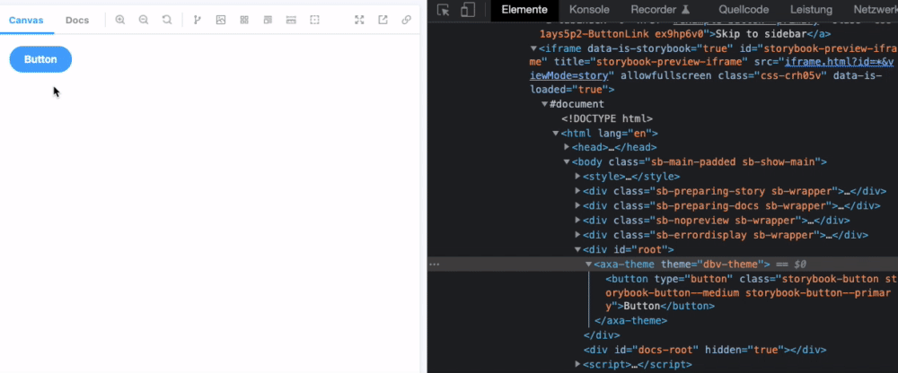

# Storybook Addon Theme Switcher

Greatly inspired by [@storybook/storybook-addon-themes](https://storybook.js.org/addons/storybook-addon-themes).

The tiny difference is, that you will NOT only have a class selector changed in your body html. You get a global theme id everywhere in your storybook, that can used as a theme-state to control your themes.

This Storybook Theme Decorator can be used to add a custom HTML class or classes to the preview in [Storybook](https://storybook.js.org).



## Compatibility

This version is compatible with storybook version `6.0.x`.

## Installation

```sh
npm i -D @axa-de/storybook-addon-theme-switcher
```

## Getting started

Then activate the addon by adding it to the storybook `main.js` file (located in the Storybook config directory):

```jsx
module.exports = {
  addons: [
    // Maybe other addons here...
    'storybook-addon-theme-switcher'
    // Or here...
  ],
};
```

See the [storybook documentation](https://storybook.js.org/docs/addons/using-addons/) for more informations.

## Parameters

The `themes` parameter accept an array of `Theme` object.

Each `Theme` is an object with the following properties:

* `name` (`string`): Name of the theme
* `id` (`string`): ID of the theme

The `themes` parameter also accept an object with the following properties:

* `default` (`string` - optional): Name of theme selected by default
* `themes` (`Theme[]` - required): The list of themes


## Configuration

### Globally

You can configure the themes globally in the storybook `preview.js` file:

```jsx
export const parameters = {
  themes : [
      {name: "axa", id: "axa", default: true},
      {name: "dbv", id: "dbv"},
  ],
  defaultThemeName : "axa",
};
```


```jsx
addParameters({
  "storybook-theme-switcher": {
    themes: [
      { name:  "axa", id: "axa", default: true },
      { name: "dbv", id: "dbv" },
    ],
    defaultThemeName: "axa",
  },
});
```

See the [storybook documentation](https://storybook.js.org/docs/addons/using-addons/#global-configuration) for more informations.

### Usage with Decorators

```jsx

addDecorator((Story, context) => {
  const { globals: { selectedThemeName } } = context;
  return html`
    <axa-theme theme=${selectedThemeName}>
      ${Story()}
    </axa-theme>
  `
});

```

